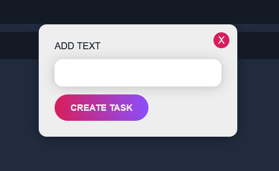

I have created the backend in folder name "api" and the frontend in "client"

I have created it with mongo shell 

To run the app:

     Backend: Go to api and open the terminal and type "npm start" it will start on localhost:3001
     Frontend: Go to client and open terminal and type "npm start" it will run on localhost:3000

It has has the CRUD operations to Create, Read, Update and Delete the data

Fetching Tasks

Adding Tasks

Completing Tasks

Editing Category

Editing Priority

Sorting by Category

Sorting by Priority

Delete the Task by clicking cross button

Thank You!!